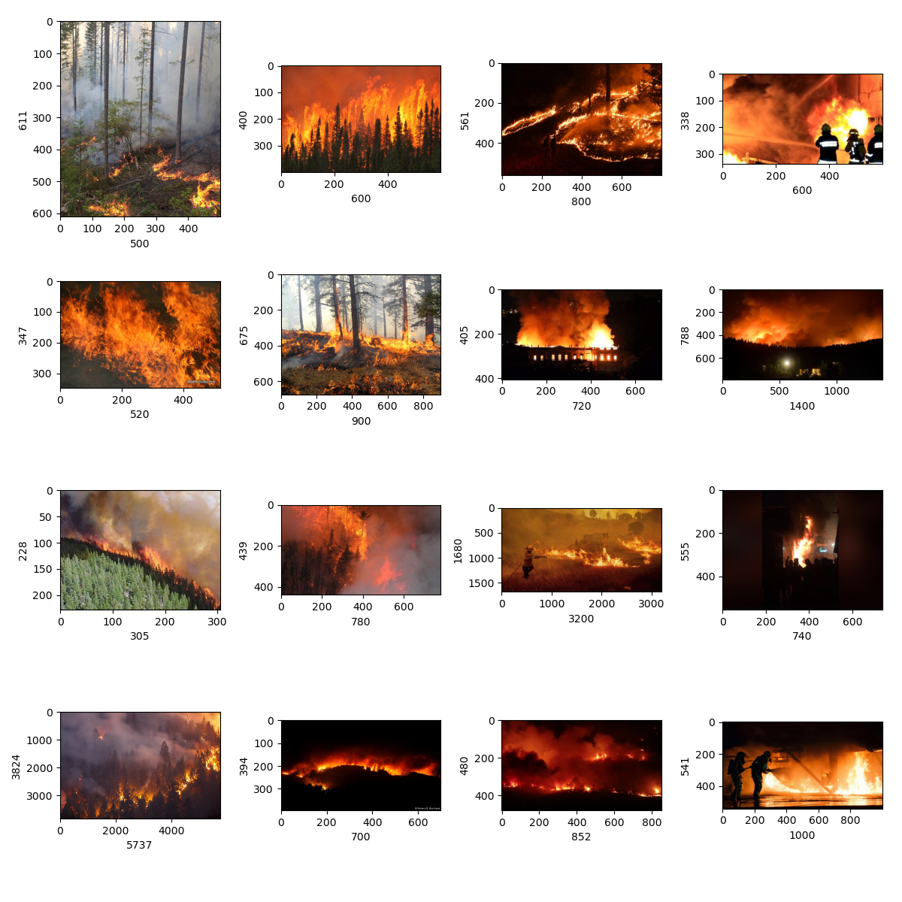

# Fire Detection Project 🔥

**Created by:**

- https://github.com/norbertkocon94
- https://github.com/asosialuk
- Dagmara

# Information

<code>A small project, the aim of which is to automate the detection of forest fires.</code>

# Dataset
<code>
We worked on the data set located on Kaggle (https://www.kaggle.com/phylake1337/fire-dataset).

Below there are samples of data from the set and their dimensions.
</code>

<code>
As we can see, the set is divided into photos with and without fire.

To train the model well, we used the ImageDataGenerator library to automate the photo preparation process (scaling, VGG mask, normalization)
</code>

`We used a simple neural network to build the model. A summary is provided below.`

# Model Summary

Our model achieves an accuracy of over **90%.** On the **heroku** website, you can check how our application works in the photos.

